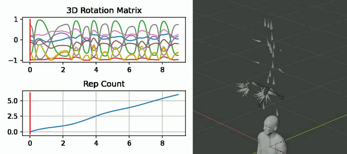

<p align="left">
  
</p>

# Infinity SenseFit API

<p align="center">
  
</p>

The SenseFit API generates synthetic data for applications at the intersection of on-body **sens**ing (e.g. IMU) and **fit**ness. The API currently allows users to generate simulated time series corresponding to angular position data captured at the wrist (e.g. with a smart watch). Ground-truth labels include continuous, per-frame rep counts.

This folder contains the following tutorial notebooks:

- [explore_api_parameters.ipynb](explore_api_parameters.ipynb): This notebook shows how to (1) submit a job to the remote API endpoint for generating synthetic IMU (angular position) data, and (2) visualize the resulting time series + motion videos. It goes through different API parameters to show how they can be used for generating specifically curated synthetic datasets.

- [large_job_demo.ipynb](large_job_demo.ipynb): This notebook shows how to submit many (100s) of jobs in a single batch, query their status in non-blocking mode, and compile the dataset's metadata into a dataframe for easy summarization/querying.

- [rep_counting_demo.ipynb](rep_counting_demo.ipynb): This notebook shows how synthetic data generated by the SenseFit API can be used to (1) train a rep counting model that generalizes to the real world, and (2) iteratively improve a model's performance by generating synthetic data around specific failure modes.

## Parameter Description

For convenience, we provide the parameters of the SenseFit API along with their input constraints below:

- `num_reps`: Number of reps in the rep sequence
  - Integer that must be within range of 1 to 10 (inclusive)
  - Default value of 1
- `exercise`: Name of exercise used in animation. See [below](#available-exercises) for a video of each.
  - String that must be one of:
    - "ARM_RAISE"
    - "BARBELL_BACK_SQUAT"
    - "BARBELL_BICEP_CURL"
    - "BENT_OVER_SINGLE_ARM_DUMBBELL_TRICEP_KICKBACK_RIGHT"
    - "BICEP_CURL"
    - "BURPEE"
    - "CRUNCH"
    - "EXPLOSIVE_PUSH_UP"
    - "HAMMER_CURL"
    - "ONE_ARM_DUMBBELL_PUSH_PRESS_LEFT"
    - "OVERHEAD_PRESS"
    - "PUSH_UP"
    - "SINGLE_ARM_DUMBBELL_PRESS_LEFT"
    - "SINGLE_ARM_DUMBBELL_SPLIT_SQUAT_RIGHT"
    - "SIT_UP"
    - "UPPERCUT_LEFT"
    - "V_UP"
  - Required (if not using random motion)
- `watch_location`: Wrist where device will be placed
  - String that must be one of {"LEFT", "RIGHT"}
  - Required
- `crown_orientation`: Which side the watch crown should point (from first-person perspective)
  - String that must be one of {"LEFT", "RIGHT"}
  - Required
- `ref_xy_rotation`: Rotation (in XY plane) of reference orientation in radians (simulates [xArbitraryZVertical](https://developer.apple.com/documentation/coremotion/cmattitudereferenceframe/1615953-xarbitraryzvertical) behavior on Apple Watch)
  - Float in range of 0 to 2 pi
  - Required
- `seconds_per_rep`: Baseline speed of animation, in units of seconds per rep
  - Float in range of 1.0 to 3.0
  - Required (if not using random motion)
- `max_rel_speed_change`: Maximum speed change introduced, relative to baseline speed.
  - Float in range of 0 to 1
  - Default value of 0
- `trim_start_frac`: Fraction of seed animation (from start to midpoint) to truncate at the start
  - Float in range of 0 to 1
  - Default value of 0
  - `trim_start_frac + trim_end_frac` cannot exceed 0.9
- `trim_end_frac`: Fraction of seed animation (from start to midpoint) to truncate at the end
  - Float in range of 0 to 1
  - Default value of 0
  - `trim_start_frac + trim_end_frac` cannot exceed 0.9
- `kinematic_noise_factor`: Fraction used to control amount of kinematic variation between reps in a given rep sequece.
  - Float in range of 0 to 1
  - Default value of 1 (maximum variation)
- `randomize_body_shape`: If True, SMPLX body shape will be randomized
  - Boolean
  - Defaults to False
- `use_random_motion`:  If True, random motion will be used for animation (rather than exercise reps)
  - Boolean
  - Defaults to False
- `num_random_frames`: Number of random frames to export if using random motion
  - Integer in range of 10 to 500 (inclusive)
  - Default value of 100
- `frames_per_second`: Sampling rate of exported time series and video
  - Integer that must be one of {20, 30, 40}
  - Default value of 20
- `image_width`: Width dimension of rendered video, in pixels
  - Integer in range of 224 to 1024 (inclusive)
  - Default value of 480
- `image_height`: Height dimension of rendered video, in pixels
  - Integer in range of 224 to 1024 (inclusive)
  - Default value of 480
- `random_seed`: Random seed for reproducibility
  - Integer in the range of 0 to 2^31-1 (inclusive)
  - If not specified, randomness in kinematic and cadence variation is not reproducible.

An example parameterization for the SenseFit API expressed as a Python `dict`:

```
params_dict = {
	"exercise": "BICEP_CURL",
	"num_reps": 5,
	"watch_location": "LEFT",
	"crown_orientation": "RIGHT",
	"seconds_per_rep": 2.10962378261473,
	"max_rel_speed_change": 0.2864222237369177,
	"trim_start_frac": 0.1792410375659265,
	"trim_end_frac": 0.10806865443101575,
	"ref_xy_rotation": 5.3396218455002895,
	"random_seed": 387
}
```

## Available Exercises

<p align="center">
  
</p>

## API Outputs
For each job, a zipped archive can be downloaded that includes the following files:

- `job.json`: Contains parameters that were used for job submission.
- `data.csv`: Contains synthetic angular position data and ground truth rep count labels. 
  - The angular position data is provided in the form of 3D rotation matrices (see [below](#how-to-use-synthetic-data-with-real-world-data)). Column headers for the rotation matrix data are formatted as `rotation_matrix_m{row}{column}`. 
  - Two versions of rep count labels are provided. `rep_count_from_start`  is indexed relative to the start of the video. It considers the pose visualized in the first frame of the video to be the starting (and ending) position of a rep. `rep_count_from_intermediate` is instead indexed to the intermediate (midpoint) pose of the rep sequence. For example, if `rep_count_from_start` is indexed to the point of most extension, then `rep_count_from_intermediate` is indexed to the point of most flexion. We provide both since users may wish to define the point of most flexion OR the point of most extension as the rep inflection point.
- `video.mp4`: Video of the animated armature and mesh corresponding to the generated IMU data. The 3-axis coordinate system visualized on the wrist represents the simulated orientation of the device. The other (non-moving) 3-axis coordinate system that is visualized represents the reference orientation. The data provided in `data.csv` is the relative difference between these two orientations.

## How to use synthetic data with real world data
 
We provide angular position in 3D rotation matrix representation since (1) we have confirmed these match the rotation matrices sampled directly from the [CoreMotion SDK](https://developer.apple.com/documentation/coremotion), and (2) a convenient continuous representation that can be used for ML models is simply the first two columns of the rotation matrix [[ref](https://arxiv.org/abs/1812.07035)].